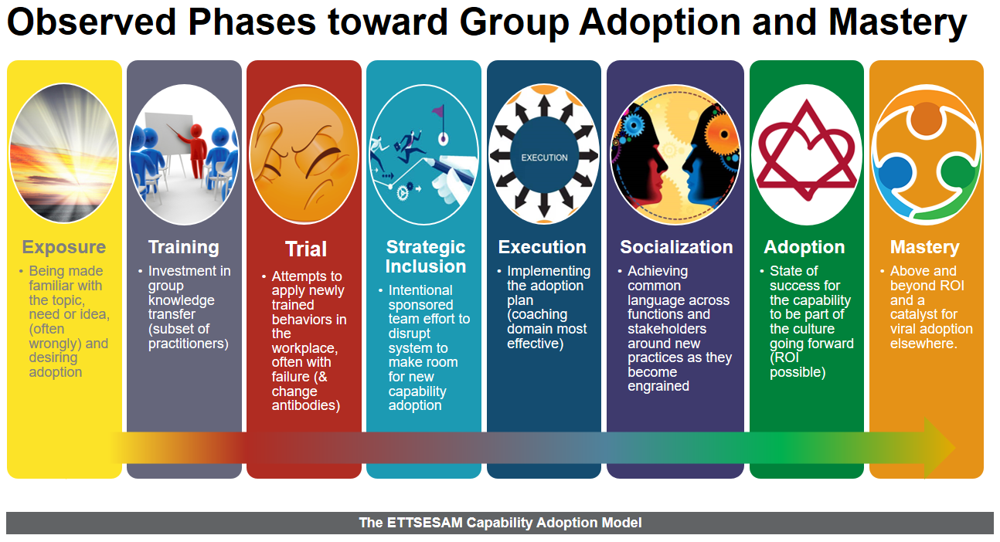

# Dojo Immersive Learning Engagement Proposal for XYZ Corp 
### The Current Challenge 

As XYZ has invested heavily to modernize IT application infrastructure and shift software operations to the Cloud, the required organizational learning required to transition effectively has fallen short of planned expectations and increased both CAPEX and OPEX costs for the organization, as well as delays in product roadmap delivery goals. Efforts to simply hire more talent fluent in modern practices haven't panned out, nor has traditional training and incentives. Longstanding in-house Agile transformation programs, although comprehensive, have not been able to catalyze the overall shift needed to transform the patterns of practice required to thrive and compete in todays digital marketplace.

Additionally, many in XYZ leadership recognize the benefits of investing in technical upskilling throughout the organization, but need help to launch learning programs that provide a competitive advantage as an employee benefit, measurable by improved employee retention. 

Solving for such a multi-layered problem requires support not only from leadership, but a system-wide willingness to re-align both Product and technical priorities toward achieving effective Continuous Delivery. Whereas in times past, the challenges described here were not addressed with a broad enough approach, studies have shown that a shift toward [becoming a learning organization](https://hbr.org/2008/03/is-yours-a-learning-organization) in one or more verticals can overcome these common challenges in a demonstrable and repeatable pattern.

Without a strategic approach that incorporates adopting new skills within each team's real work, in their real context, with their daily constraints, the benefits aren't likely to stick as current practices aren't properly addressed. What companies commonly get instead is a protracted skills adoption experience, meted out in phases with a delayed ROI.

### The Solution Path

While investing in becoming a learning organization can be interpreted as a huge and perhaps ambiguous risk, starting small by sponsoring the launch of an immersive learning program in a strategic area provides the best path to bring your people up to speed with your modernization goals.

It is true that adoption and mastery of new skills requires focused time away from current demands, AND current demands make it hard to find focused time to carve out. Nonetheless, the answer isn't to settle for shallow exposure to the new needed skills and hope they get traction, but rather to combine the practice of applying new skills into current production demands in an intentional and safe way. 

This is achieved by implementing a number of Dojo engagements where teams are immersed into achieving their learning goals in the context of their current work demands. Work does not stop while team members are out in training in an abstracted context, but work does temporarily slow down while old practices are traded out for new ones. And since the team learns together, productivity then rapidly speeds up to new levels as the usual undulations of group skills mastery are mitigated and de-phased.
